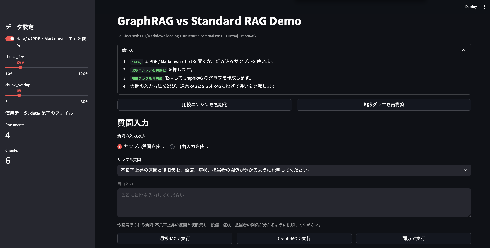
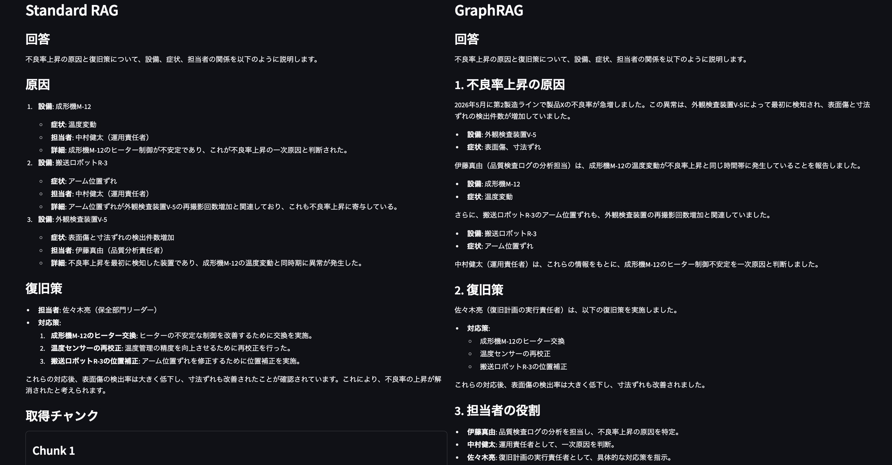
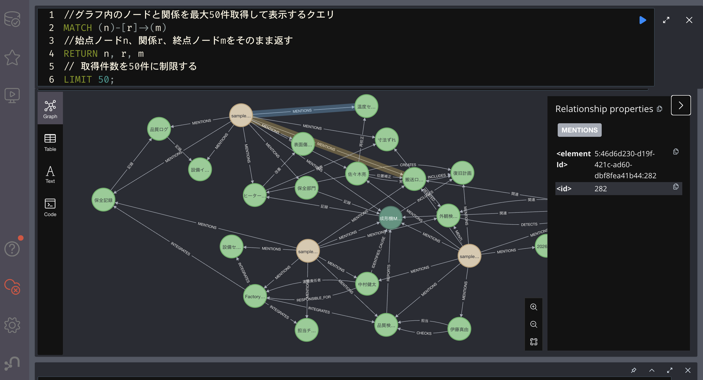

# GraphRAG Sample App

OpenAI API、LangChain、Neo4j、Streamlit を用いて、通常RAGとGraphRAGを比較できるサンプルアプリです。

## 特徴

- Streamlit UI による比較画面
- OpenAI Chat Model: `gpt-4o-mini`
- OpenAI Embedding Model: `text-embedding-3-small`
- 通常RAG: `FAISS` を用いたベクトル検索
- GraphRAG: LangChain `LLMGraphTransformer` + Neo4j
- `data/` 配下の PDF / Markdown / Text ファイル読込対応
- 比較UIの強化, 取得チャンクとグラフ拡張コンテキストを確認可能
- Docker Compose による再現可能な環境構築

### webアプリのトップ画面

<p align="center">
  
</p>

## ディレクトリ構成

```text
.
├── app
│   ├── core
│   │   ├── chunker.py
│   │   ├── config.py
│   │   ├── document_loader.py
│   │   ├── graphrag.py
│   │   ├── rag.py
│   │   └── sample_data.py
│   ├── ui
│   │   └── streamlit_app.py
│   └── main.py
├── data
├── scripts
│   └── init_neo4j.cypher
├── .env.example
├── .gitignore
├── docker-compose.yml
├── Dockerfile
├── README.md
├── docs.md
└── requirements.txt
```

## セットアップ

1. `.env.example` をコピーして `.env` を作成します。
2. `OPENAI_API_KEY` を設定します。
3. 必要に応じて `data/` に PDF / Markdown / Text ファイルを追加します。
4. 以下を実行します。

```bash
cp .env.example .env
docker compose up --build
```

5. ブラウザで以下を開きます。
   - Streamlit: [http://localhost:8501](http://localhost:8501)
   - Neo4j Browser: [http://localhost:7474](http://localhost:7474)

## 使い方

1. Sidebar で `data/ のPDF・Markdown・Textを優先` を選択
2. `chunk_size` `chunk_overlap` を調整
3. `比較エンジンを初期化` を実行
4. `知識グラフを再構築` を実行して知識グラフを生成
5. 質問入力で `サンプル質問を使う` または `自由入力を使う` を選択
6. `今回実行される質問` を確認してから `通常RAGで実行` `GraphRAGで実行` `両方で実行` のいずれかを押す
7. 下部の Documents / Chunks プレビューで入力内容を確認

## 出力例

- 「不良率上昇の原因と復旧策を、設備、症状、担当者の関係が分かるように説明してください。」に対するRAGとGraphRAGの回答例を示します。
- RAG は、取得したチャンクをもとに原因と復旧策を素直に説明します。原因と復旧策はまとまっていますが、説明がやや列挙的です。
- GraphRAG は、設備・症状・担当者の関係をつなげて整理し、因果関係や役割分担を分かりやすく説明します。
  - 設備ごとの症状が「成形機M-12 → 温度変動」「搬送ロボットR-3 → アーム位置ずれ」「外観検査装置V-5 → 表面傷・寸法ずれ」のように整理され、どの異常がどの設備に対応するかが分かりやすい
  - 原因 → 判断 → 復旧策 → 役割分担の順で構造化されており、関係のつながりを追いやすい
  - 一方で、時系列の前置きなど、質問の主眼に対しては少し情報を補いすぎている印象あり

### Standard RAG vs. GraphRAG 比較画面の全体例

<p align="center">
  
</p>

### 知識グラフ例
* `LLMGraphTransformer`にてテキストからノードや関係を抽出してグラフ構造として表現
* 以下はグラフ内のノードと関係を最大50件取得して表示したものである

<p align="center">
  
</p>


## PoC 重視にしたポイント

- 構成をシンプルに維持
- PDF / Markdown / Text の読込だけを追加
- 比較UIを強化し、通常RAGとGraphRAGの差を見やすくした
- チャンク分割パラメータをその場で試せるようにした
- 取得チャンクとグラフ拡張コンテキストを可視化した

## 同梱サンプルデータ

- `sample_factory_overview.md`: 製造ライン監視システム「FactoryPulse」の概要データ
- `sample_factory_incident.md`: 不良率上昇インシデントの記録データ
- `sample_factory_maintenance.md`: 保全記録および復旧対応履歴データ
- `sample_factory_relations.md`: 設備・異常・原因・担当者・対応策の関係整理メモ

## Neo4j Console での知識グラフ確認方法

```cypher
// グラフ内のノードと関係を最大50件取得して表示するクエリ
MATCH (n)-[r]->(m)
// 始点ノードn、関係r、終点ノードmをそのまま返す
RETURN n, r, m
// 取得件数を50件に制限する
LIMIT 50;
```

### 参考サイト
* [GraphRAGを実際に構築して分かった「使うほど賢くなるAI」の仕組み](https://zenn.dev/okikusan/articles/0f8295e7ecaa19)
* [Langchain+Neo4j で「GraphRAG」を実装してみる](https://www.chowagiken.co.jp/future-studio/graph_rag/)
* [Neo4jで始めるGraphRAG入門](https://zenn.dev/timelab/articles/23c0705465e0b4)
